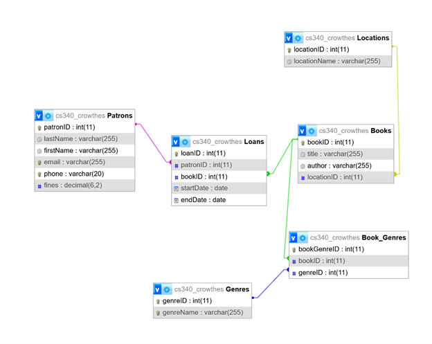

# Library Database Backend Project

## How to Run the Project
1. **Clone the Repository**:
   * Use `` to pull the repo to your local machine.
2. **Load the sample information into your database** 
    * Load the `DDL.sql` into your SQL database, based on your database preference.
3. **Configure your server information**
    * Fill out your database and host connection information in `./database/db-connector.js`
4. **Install all the required packages.**
    ```bash
    npm install
    ```
5. **Start the server**
    ```bash
    npm start
    ```

## Business Background
Westchester Public Library is a small local public library and has 5,000 patrons and 10,000
books available for patrons to borrow. Due to limited budget, the library needs a lightweight
system to manage their inventory so that items and loans are tracked accurately. A database
driven website will keep track of the books borrowed by each patron, and keep track of the
location of a book if the book is inside the library. The database will also include book author
and genre information. This will aid the library to know which books tend to get checked out
more and what kind of books to buy for the library in the future.

## Entity-Relationship Diagram and Schema:




## Database Outline
**Books:** record of library book’s details, which are loaned to Patrons
* bookID: int, auto_increment, unique, not Null, PK
* title: varchar, not Null
* author: varchar, not Null
* locationID: int, optional FK
* Relationship: 1:M between Books and Loans. Optional M:1 with Locations (many
books can be in one location. If a book’s locationID is NULL, it means this book is
lost because we don’t have a location record for this book anymore.). M:M
between Patrons and Books (Loans serves as an intersection table). M:M
between Books and Genres. An intersection table representing Books and
Genres M:M relationship is not shown here and will be created in the
implementation phase. This intersection table will only use bookID and genreID
as foreign keys, without any additional attributes

**Patrons:**  record of library Patron’s information who make Loans
* patronID: int, auto_increment, unique, not Null, PK
* lastName: varchar, not Null
* firstName: varchar, not Null
* email: varchar, not Null, unique
* phone: int(10), not Null, unique
* fines: int
* Relationship: 1:M with Loans, M:M between Patrons and Books (Loans serves as
an intersection table).

**Loans:** record of Patrons borrowing library books
* loanID: int, auto_increment, unique, not Null, PK
* patronID: int, not Null, FK
* bookID: int, not Null, FK
* startDate: date, not Null
* endDate; data, not Null
* Relationship: M:1 with Patrons, M:1 with books (many loans are possible with a
single Patron or a single book checked out at different times). Serves as an
intersection table between Books and Patrons.

**Genres:** record of genre details of books. This is a category table.
* genreID: int, auto_increment, unique, not Null, PK
* genreName: varchar, unique, not Null
* Relationship: M:M with books. An intersection table representing Books and
Genres M:M relationship is not shown here and will be created in the
implementation phase. This intersection table will only use bookID and genreID
as foreign keys, without any additional attributes

**Locations:** record of the Location of the books inside the library, ID indicating shelf
number except for 1 which corresponds to checked out.
* locationID:int, auto_increment, unique, not Null, PK
* locationName: varchar, not Null
* Relationship: Optional 1:M with books.

## Data Definition Language and Data Manipulation Query
For each table, implemented CRUD operations as well as display selected data using joins.
Sample snippet: 
```
-- Display select books-genres relationships
SELECT Books.title, Genres.genreName
FROM Books
INNER JOIN Books_Genres ON Books.bookID = Books_Genres.bookID
INNER JOIN Genres ON Books_Genres.genreID = Genres.genreID
WHERE Books.title = :book_name AND Genres.genreName = :genre_name;
```
Please refer to the DDL.sql and DMQ.sql file for details. 
 

## Citations and References

### General citations
The only source of refrence is from the CS 340 Node.js **starter code for the server with extensive modifications**

For calls to render() and usages of db.pool.query(), as well as error handling we referred to the CS 340 starter code

https://github.com/osu-cs340-ecampus/nodejs-starter-app/tree/main

### Data display
We refered to the code ideas in nodejs-starter-app for the displaying data in app.js file with extensive modifications

For files in views folder with usage of for {{#each data}} and {{this.attribute}} we referred to the referred to the CS 340 starter code

https://github.com/osu-cs340-ecampus/nodejs-starter-app/tree/main/Step%204%20-%20Dynamically%20Displaying%20Data

```
// app.js

app.get('/', function(req, res)
    {  
        let query1 = "SELECT * FROM bsg_people;";               // Define our query

        db.pool.query(query1, function(error, rows, fields){    // Execute the query

            res.render('index', {data: rows});                  // Render the index.hbs file, and also send the renderer
        })                                                      // an object where 'data' is equal to the 'rows' we
    });                                                         // received back from the query
```
```
{{!-- Create a table --}}
<table>

    {{!-- Header section --}}
    <thead>

        {{!-- For just the first row, we print each key of the row object as a header cell so we
        know what each column means when the page renders --}}
        <tr>
            {{#each data.[0]}}
            <th>
                {{@key}}
            </th>
            {{/each}}
        </tr>
    </thead>

    {{!-- Body section --}}
    <tbody>

        {{!-- For each row, print the id, fname, lname, homeworld and age, in order --}}
        {{#each data}}
        <tr>
            <td>{{this.id}}</td>
            <td>{{this.fname}}</td>
            <td>{{this.lname}}</td>
            <td>{{this.homeworld}}</td>
            <td>{{this.age}}</td>
        </tr>
        {{/each}}
    </tbody>
</table>
```


### Dynamically drop-downs
We refered to the code ideas in nodejs-starter-app for the dynamically drop-downs in app.js file, with extensive modifications

https://github.com/osu-cs340-ecampus/nodejs-starter-app/tree/main/Step%206%20-%20Dynamically%20Filling%20Dropdowns%20and%20Adding%20a%20Search%20Box

```
    // Declare Query 1
    let query1 = "SELECT * FROM bsg_people;";

    // Query 2 is the same in both cases
    let query2 = "SELECT * FROM bsg_planets;";

    // Run the 1st query
    db.pool.query(query1, function(error, rows, fields){
        
        // Save the people
        let people = rows;
        
        // Run the second query
        db.pool.query(query2, (error, rows, fields) => {
            
            // Save the planets
            let planets = rows;
            return res.render('index', {data: people, planets: planets});
        })
```
```
    <select name="input-homeworld" id="input-homeworld-ajax">
        <option value="">Select a Planet</option>
        {{#each planets}}
        <option value="{{this.id}}">{{this.name}}</option>
        {{/each}}
    </select>
```

### Set up Node.js and database connection
app.js setting up

https://github.com/osu-cs340-ecampus/nodejs-starter-app/tree/main/Step%200%20-%20Setting%20Up%20Node.js


```
// App.js

/*
    SETUP
*/
var express = require('express');   // We are using the express library for the web server
var app     = express();            // We need to instantiate an express object to interact with the server in our code
PORT        = 9124;                 // Set a port number at the top so it's easy to change in the future

/*
    ROUTES
*/
app.get('/', function(req, res)                 // This is the basic syntax for what is called a 'route'
    {
        res.send("The server is running!")      // This function literally sends the string "The server is running!" to the computer
    });                                         // requesting the web site.

/*
    LISTENER
*/
app.listen(PORT, function(){            // This is the basic syntax for what is called the 'listener' which receives incoming requests on the specified PORT.
    console.log('Express started on http://localhost:' + PORT + '; press Ctrl-C to terminate.')
});
```
Handlebar configs
```
const { engine } = require('express-handlebars');
var exphbs = require('express-handlebars');     // Import express-handlebars
app.engine('.hbs', engine({extname: ".hbs"}));  // Create an instance of the handlebars engine to process templates
app.set('view engine', '.hbs');                 // Tell express to use the handlebars engine whenever it encounters a *.hbs file.

```

In the database folder we have a file name db-connector.js which we referred to the referred to the CS 340 starter code

```
// ./database/db-connector.js

// Get an instance of mysql we can use in the app
var mysql = require('mysql')

// Create a 'connection pool' using the provided credentials
var pool = mysql.createPool({
    connectionLimit : 10,
    host            : 'classmysql.engr.oregonstate.edu',
    user            : 'cs340_[your_onid]',
    password        : '[your_db_password]',
    database        : 'cs340_[your_onid]'
})

// Export it for use in our applicaiton
module.exports.pool = pool;
```

https://github.com/osu-cs340-ecampus/nodejs-starter-app/tree/main/Step%201%20-%20Connecting%20to%20a%20MySQL%20Database


### More citation details are commented in app.js file
